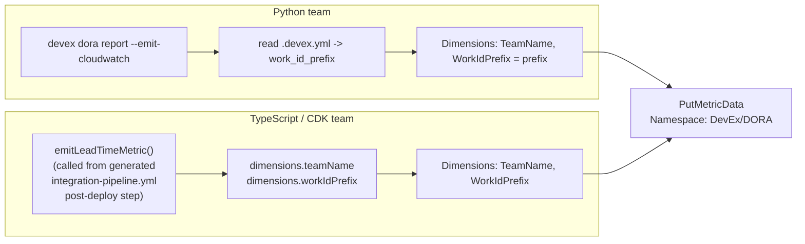

# Design: DORA Telemetry Consistency

## Approach

Both implementations share three things by convention, not by calling a shared service:

1. **Namespace**: `DevEx/DORA`, hardcoded as a literal string in both
   `tools/devex-cli/src/devex/commands/dora.py` and
   `packages/workflow-framework/src/dora/metrics.ts`.
2. **Dimension names**: `TeamName` and `WorkIdPrefix`, attached to every `PutMetricData` /
   `put_metric_data` call.
3. **Metric names**: `DeploymentFrequency`, `LeadTimeForChanges`, `ChangeFailureRate`, `MTTR` —
   identical strings in both languages.

There is deliberately no shared runtime dependency between the CLI and the framework (no
network call, no shared library import) — see `.kiro/steering/tech.md` for why a central
service is avoided. Consistency is enforced by convention plus tests, not by a single code
path.

## Data flow

Both paths land in the same namespace with the same dimension *names*. A CloudWatch Insights
query or dashboard widget filtering on `WorkIdPrefix` returns matching data regardless of
which tool produced it.

## Why fail closed instead of defaulting

An earlier version of `_emit_to_cloudwatch()` emitted metrics with no dimensions at all when
`.devex.yml` was missing — every team without it configured would have collapsed into a
single undimensioned series, silently breaking comparability. The fix raises a clear error
instead of guessing a default team name, consistent with `devex init`'s existing policy of
refusing a silent `work_id_prefix` default (see ADR-001, Component Decisions).

## Testing

- `tools/devex-cli/tests/test_pbt_validators.py` and `test_work_id_validator.py` cover the
  `work_id_prefix` format that both tools rely on as the shared team identifier.
- `packages/workflow-framework/test/conventions.test.ts` asserts the TS-side regex matches
  the same format.
- There is no automated test for the actual `PutMetricData` call (it requires AWS
  credentials) — this is a known coverage gap, not a correctness guarantee.
