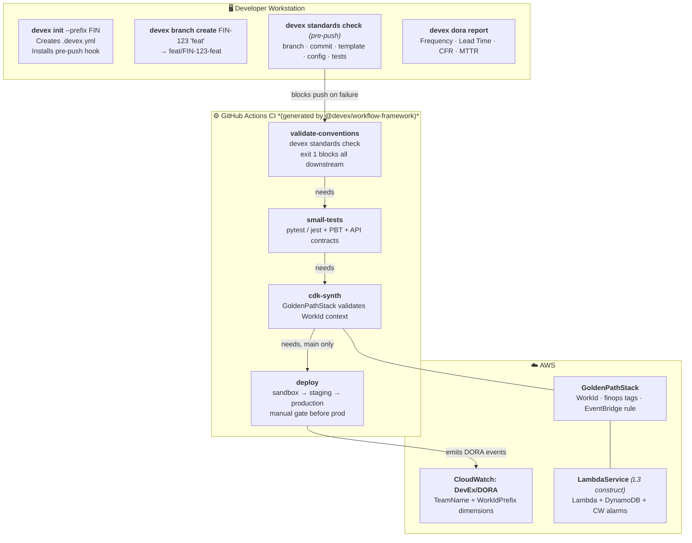

# DevEx Framework

> **Golden Path tooling for engineering teams** — enforce conventions, generate pipelines, and track DORA metrics across polyglot microservices.

[](https://github.com/urielabin/devex-framework/actions)
[](https://github.com/urielabin/devex-framework/actions)
[](LICENSE)

---

## Overview

The DevEx Framework provides two complementary tools that implement a **Golden Path** — opinionated defaults that make the right way the easiest way for engineering teams.

| Component | Language | Install via | Purpose |
|-----------|----------|-------------|---------|
| **`devex` CLI** | Python | `uv` | Branch creation, convention checks, DORA reporting |
| **`@devex/workflow-framework`** | TypeScript | `pnpm` | Typed CI/CD pipeline generators and AWS CDK L3 constructs |

Both tools are **language-agnostic at runtime** — a Python team and a Go team use the same conventions, the same DORA metrics namespace, and the same CI pipeline shape.

---

## Architecture

The two components integrate across the full delivery lifecycle.



### Shift-Left Enforcement

Defects are caught at the earliest possible layer — compliance is cheaper than non-compliance at every step.

| Layer | Mechanism | When |
|-------|-----------|------|
| **Local** | pre-push hook — conventions + lint + tests | Before git push |
| **PR** | validate-conventions CI job — exit 1 blocks all downstream | Before tests run |
| **AI Review** | Amazon Q Developer inline PR comments | On PR open / update |
| **Synth** | GoldenPathStack validates WorkId CDK context | Before CloudFormation |
| **Deploy** | CloudWatch DORA alarms on metric thresholds | After production deploy |

The AI Review layer is provided by the [Amazon Q Developer GitHub App](https://github.com/marketplace/amazon-q-developer) — install it on the repo and it automatically reviews every new or reopened PR with inline comments. No custom workflow file is needed; reviewers can also trigger an on-demand pass with a `/q review` PR comment.

---

## Language Support

`devex init` auto-detects the project type and configures the appropriate lint and test gates.

| Language | Detected by | Pre-push gates | Pipeline type |
|----------|-------------|----------------|:-------------:|
| Python | `pyproject.toml` | ruff · mypy · pytest | `python` |
| Node.js / TypeScript | `package.json` | pnpm lint · pnpm test | `node` |
| AWS CDK (TypeScript) | `cdk.json` | pnpm lint · pnpm test · cdk synth | `cdk` |
| Go | `go.mod` | go vet · go test -short | `go` _(community)_ |
| Other | — | Convention checks only | — |

To add support for a new language, see [CONTRIBUTING.md — Adding New Language Support](CONTRIBUTING.md#adding-new-language-support).

---

## Installation

### Python CLI

Requires [uv](https://docs.astral.sh/uv/) ≥ 0.4.

```bash
# Install directly from the repository
uv tool install "git+https://github.com/urielabin/devex-framework#subdirectory=tools/devex-cli"
devex --help
```

<details>
<summary>Local development setup</summary>

```bash
git clone https://github.com/urielabin/devex-framework
cd devex-framework/tools/devex-cli
export UV_NO_EDITABLE=1   # see macOS note below
uv sync
uv run devex --help
```

> **macOS note:** `UV_NO_EDITABLE=1` is required. A known interaction between `uv`'s
> editable-install shim and macOS's hidden-file flag causes Python's `site.py` (3.9-3.14) to
> silently skip the shim, breaking `import devex`. Setting `UV_NO_EDITABLE=1` makes `uv`
> install a real copy instead, avoiding the issue — `uv sync` re-copies on every run, so source
> edits are still picked up. Not needed on Linux/CI.

</details>

### TypeScript Framework

Requires [pnpm](https://pnpm.io/) ≥ 9 and Node.js ≥ 20.

```bash
# Install directly from the repository
pnpm add "github:urielabin/devex-framework#path:packages/workflow-framework"
```

> **pnpm note:** the package builds itself on install (no published `dist/` in git), via a
> `prepare` script. pnpm blocks build scripts from git-hosted deps by default for supply-chain
> safety, so the first `pnpm add` will fail with `ERR_PNPM_GIT_DEP_PREPARE_NOT_ALLOWED`. Copy the
> exact `allowBuilds` key it prints (it includes the resolved commit URL, so it's specific to
> your install) into your project's `pnpm-workspace.yaml`, then re-run `pnpm add`:
>
> ```yaml
> allowBuilds:
>   "@devex/workflow-framework@https://codeload.github.com/urielabin/devex-framework/tar.gz/<commit-sha>#path:packages/workflow-framework": true
> ```

<details>
<summary>Local development setup</summary>

```bash
cd devex-framework/packages/workflow-framework
pnpm install
pnpm build
```

</details>

---

## Quick Start

### 1. Bootstrap your project

```bash
cd /path/to/your-service
devex init --prefix FIN
```

This creates three files:

- **`.devex.yml`** — Golden Path config (Work ID prefix, project type, two-reviewer policy)
- **`.github/pull_request_template.md`** — standardised PR template with Work ID field
- **`.git/hooks/pre-push`** — runs conventions, language-appropriate lint, and unit tests before every push

### 2. Create a compliant branch

```bash
devex branch create FIN-123 "add payment endpoint"
# Creates: feat/FIN-123-add-payment-endpoint
```

### 3. Check your repository

```bash
devex standards check
```

**DevEx Standards Check**

| Check | Status | Details |
|---|---|---|
| `BRANCH_NAME` | ✓ | `feat/FIN-123-add-payment-endpoint` |
| `COMMIT_MSG` | ✓ | `[FIN-123] add payment endpoint` |
| `PR_TEMPLATE` | ✓ | `.github/pull_request_template.md` |
| `DEVEX_CONFIG` | ✓ | `.devex.yml` |
| `TESTS_PRESENT` | ✓ | 13 test file(s) found |

All checks passed. Exit code `0` = all pass, exit code `1` = failures (blocks push and CI).

### 4. View DORA metrics

```bash
devex dora report --days 90
```

---

## TypeScript Framework Usage

### Generate a PR Pipeline

```typescript
import { generatePRPipeline } from "@devex/workflow-framework";
import { writeFileSync } from "fs";

const workflow = generatePRPipeline({
  workIdPrefix: "FIN",
  projectType: "cdk",
  awsRegion: "us-east-1",
  cdkStackName: "PaymentServiceStack",
});

writeFileSync(".github/workflows/pr-pipeline.yml", workflow);
```

The generated pipeline enforces conventions, runs unit + property-based tests, validates API contracts, synthesises the CDK stack, and deploys to sandbox.

### Generate an Integration Pipeline

```typescript
import { generateIntegrationPipeline } from "@devex/workflow-framework";

const workflow = generateIntegrationPipeline({
  workIdPrefix: "FIN",
  projectType: "cdk",
  awsRegion: "us-east-1",
  cdkStackName: "PaymentServiceStack",
});

writeFileSync(".github/workflows/integration-pipeline.yml", workflow);
```

Runs on merge to `main`: integration tests → staging → smoke tests → manual gate → production. Emits DORA events on every production deploy.

### Use the Golden Path CDK Stack

```typescript
import { GoldenPathStack, LambdaService } from "@devex/workflow-framework";
import * as dynamodb from "aws-cdk-lib/aws-dynamodb";

export class PaymentServiceStack extends GoldenPathStack {
  constructor(scope: Construct, id: string) {
    super(scope, id, {
      workIdPrefix: "FIN",
      teamName: "payments",
      ownerEmail: "payments-team@example.com",
    });

    const table = new dynamodb.Table(this, "Transactions", {
      partitionKey: { name: "PK", type: dynamodb.AttributeType.STRING },
      sortKey: { name: "SK", type: dynamodb.AttributeType.STRING },
      billingMode: dynamodb.BillingMode.PAY_PER_REQUEST,
    });

    new LambdaService(this, "PaymentCreate", {
      serviceName: "payment-create",
      handler: "handlers/payment/create/index.handler",
      codePath: "src/python",
      table,
      tableGrantType: "readWrite",
      environment: { TABLE_NAME: table.tableName },
    });
  }
}
```

The `WorkId` CDK context is required at synth time — omitting it fails the build:

```bash
cdk deploy --context WorkId=FIN-123
```

---

## Local Development Environment

Start a local DynamoDB instance for running tests without AWS credentials:

```bash
cp .env.example .env
docker compose up -d
```

| Service | URL | Purpose |
|---------|-----|---------|
| DynamoDB Local | `http://localhost:8000` | AWS-compatible DynamoDB endpoint |
| DynamoDB Admin UI | `http://localhost:8001` | Visual table browser |

Run the Python CLI tests against local DynamoDB:

```bash
export DYNAMODB_ENDPOINT=http://localhost:8000
cd tools/devex-cli && uv run pytest tests/ -v
```

---

## Running Tests

```bash
# Python CLI — lint, type check, unit tests, and property-based tests
cd tools/devex-cli
uv sync
uv run ruff check src/
uv run mypy src/
uv run pytest tests/ -v

# TypeScript Framework — lint, unit tests, build
cd packages/workflow-framework
pnpm install
pnpm lint
pnpm test
pnpm build
```

---

## Project Structure

```
devex-framework/
├── tools/devex-cli/              # Component A: Python CLI
│   ├── src/devex/
│   │   ├── commands/             # init, standards, branch, dora
│   │   ├── validators/           # work_id, branch, commit (pure functions → PBT)
│   │   ├── hooks/                # git pre-push installer
│   │   └── dora/                 # git-log DORA collector
│   └── tests/                   # unit tests + hypothesis PBT
│
├── packages/workflow-framework/  # Component B: TypeScript Framework
│   ├── src/
│   │   ├── conventions.ts        # Shared regex constants and types
│   │   ├── workflows/            # generatePRPipeline(), generateIntegrationPipeline()
│   │   ├── constructs/           # GoldenPathStack, LambdaService
│   │   └── dora/                 # CloudWatch DORA metric emitters
│   └── test/                    # Jest unit tests
│
├── .github/
│   ├── workflows/                # ci.yml, integration-pipeline.yml, release.yml
│   └── pull_request_template.md
│
├── .kiro/
│   ├── steering/                 # AI agent context for compliant code generation
│   └── specs/                    # Spec-driven development: requirements/design/tasks
├── docs/
│   ├── adr.md                    # Architecture Decision Record (source)
│   └── adr.pdf                   # Architecture Decision Record (2-page PDF)
├── docker-compose.yml            # Local DynamoDB + admin UI
├── .env.example                  # Environment variable template
├── CHANGELOG.md                  # Version history
└── CONTRIBUTING.md               # Inner-source contribution guide
```

---

## Design Document

See [`docs/adr.pdf`](docs/adr.pdf) for the Architecture Decision Record (2 pages) covering:

- Component architecture and interaction model
- Homologation strategy for 10+ team adoption without mandates
- Scalability approach — no central service in the critical path
- Shift-Left enforcement table

---

## Contributing

See [CONTRIBUTING.md](CONTRIBUTING.md) for setup instructions, Work ID conventions, and how to add new language support or CDK constructs.

All contributions require a Work ID and 2 reviewer approvals. Run `devex standards check` before opening a PR.

---
