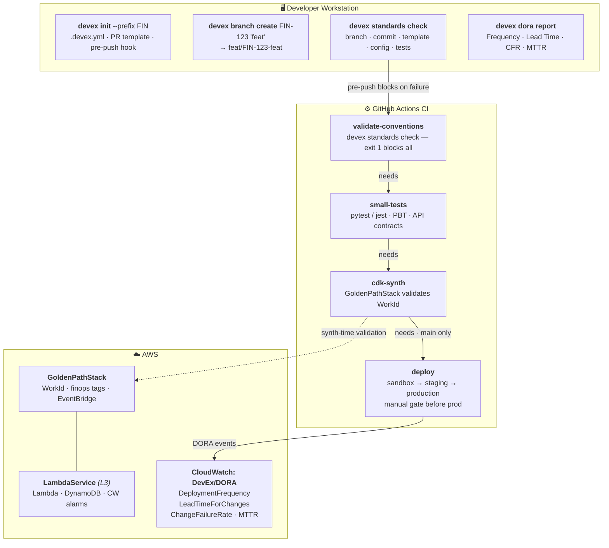

# ADR-001: DevEx Platform Architecture

**Status**: Accepted
**Date**: 2026-06-22
**Author**: Platform Engineering

---

## Context and Problem Statement

10+ independent engineering teams (Python, TypeScript, Go, Clojure) each maintain their own CI/CD pipelines, branching conventions, and deployment patterns. This causes:

- Inconsistent DORA metrics — impossible to compare Lead Time across teams
- Repeated boilerplate — every team re-implements the same CDK patterns
- Drift in compliance — branch protection, PR templates, and Work ID enforcement vary by team
- Slow feedback loops — defects discovered late in the delivery cycle

---

## Architecture

---

## Component Decisions

### Component A: Python CLI (`devex`)

**Decision**: Typer + Rich, distributed via `uv tool install`.

**Rationale**: Typer provides type-safe command definitions with zero-config help generation. `uv` is the modern Python toolchain that installs isolated tools without polluting the system. The CLI is language-agnostic — any team (Python, Go, Clojure) installs the same binary.

### Component B: TypeScript Workflow Framework (`@devex/workflow-framework`)

**Decision**: `github-actions-workflow-ts` for type-safe workflow generation; `aws-cdk-lib` L3 constructs.

**Rationale**: String-templated YAML is fragile — `github-actions-workflow-ts` provides compile-time type checking of workflow structure. L3 CDK constructs reduce repetition: instead of each team re-implementing Lambda + DynamoDB + alarms, they call `new LambdaService(...)`.

### Convention Enforcement Strategy

**Decision**: `.devex.yml` as a language-agnostic config file; Work ID enforced in 3 places (branch name, commit message, CDK context).

**Rationale**: Triple enforcement — local pre-push hook, CI job, and CDK synth — makes it cheaper to comply than to bypass. The `.devex.yml` is readable by both the CLI and the TypeScript framework, providing a single source of truth.

---

## Homologation Strategy (10+ Team Adoption)

1. **Opt-in, not mandate**: Teams run `devex init` voluntarily. The tool improves their workflow; it does not block existing pipelines.
2. **Reference implementation**: A fully-onboarded sample microservice serves as the live demo, so teams see the Golden Path applied end-to-end before adopting it themselves.
3. **Inner-source model**: `CONTRIBUTING.md` explains how teams add team-specific conventions without forking the platform.
4. **Metrics visibility**: `devex dora report` shows each team their DORA level (Elite/High/Medium/Low). Peer comparison drives adoption more effectively than mandates.

---

## Scalability (Avoiding Platform Bottlenecks)

- **No central service**: The CLI and framework are distributed packages. There is no platform API that teams depend on at runtime.
- **Versioned releases**: pnpm and uv pin package versions. Teams upgrade on their own schedule.
- **Extensible stages**: `generatePRPipeline({ stages: [...] })` lets teams opt into additional pipeline stages without modifying the framework.
- **CDK-level isolation**: `GoldenPathStack` is a base class, not a service. Teams extend it; they do not call a shared deployment service.

---

## Shift-Left Strategy

| Layer | Mechanism | When |
|-------|-----------|------|
| **Local** | pre-push hook — devex standards check + lint + tests | Before git push |
| **PR** | validate-conventions CI job — exit 1 blocks all downstream | Before tests run |
| **AI Review** | Amazon Q Developer inline PR comments | On PR open / update |
| **Synth** | GoldenPathStack validates WorkId CDK context | Before CloudFormation |
| **Deploy** | CloudWatch DORA alarms on metric thresholds | After production deploy |

Defects are caught at the earliest feasible point — a missing Work ID blocks the push, not the production deploy.
